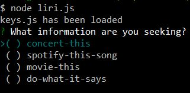
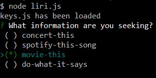
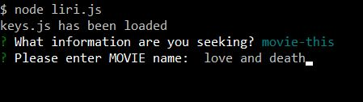
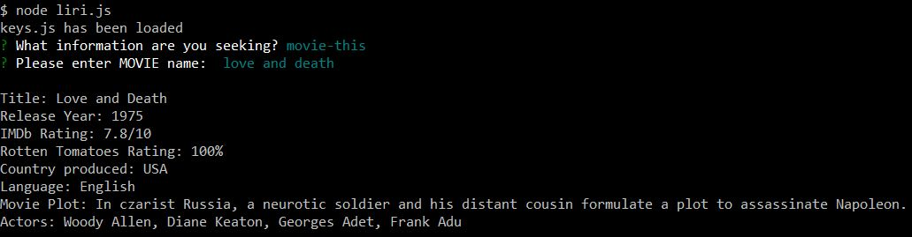

# liri-node-app
### LIRI (Language Interpretation and Recognition Interface) 


* is a command line node application
* that takes in parameters and returns data
* the data is retrieved using three different APIs:
    * Bands In Town // [Bands In Town](http://www.artists.bandsintown.com/bandsintown-api)
    * Spotify // [Spotify](https://www.npmjs.com/package/node-spotify-api)
    * OMDb //  [OMDb](http://www.omdbapi.com)

Click link for a demo [liri-node-app-demo](https://drive.google.com/file/d/1rcJGvPWDbTAUShYQGVeT5-GlA2P_BHJZ/view) 

To run liri-node-app on your system follow these instructions.

**Environment Setup**
1. Navigate to the directory on your computer you wish to set up the liri-node-app
2. Clone the liri-node-app from this repo into your directory
3. Still in that directory, from command line, type:
    * npm init -y // this will initialize a package.json file 
    * check to see if you have a .gitignore file (run: ls -a)
    * if you do not have a .gitignore file, create one and add these file names
        * node_modules
        * .DS_Store
        * .env
    * if you do have a .gitignore file, be sure it includes the 3 files listed above, if not, add them
    * if you do not have a file named ".env" create it and add the following to it:
        * the contents of the .env file should look like this:
           ```js
            # Spotify API keys

            SPOTIFY_ID=enter your key here
            SPOTIFY_SECRET=enter your secret here

            # Bands In Town key

            APP_ID=enter your id here
         ```
        Note: you must manually add YOUR API keys to file ".env" for spotify and bands in town to function

    * npm i dotenv // [more info](https://www.npmjs.com/package/dotenv) 
    * npm i node-spotify-api // [more info](https://www.npmjs.com/package/node-spotify-api) 
    * npm i request // [more info](https://www.npmjs.com/package/request)
    * npm i moment // date/time manipulation [more info](https://www.npmjs.com/package/moment)   
    * npm i inquirer // user prompting [more info](https://www.npmjs.com/package/inquirer)   

**Run Application**    

1. From a command line, in same directory where required packages were installed, enter:
    
    node liri.js

2. You will be presented with four options as shown below: 



3. Use the up-down arrow keys to navigate to the option you would like to run, press space bar to select, then enter.



4. When prompted, enter your information and press enter. 



5. Results for information entered are displayed.




